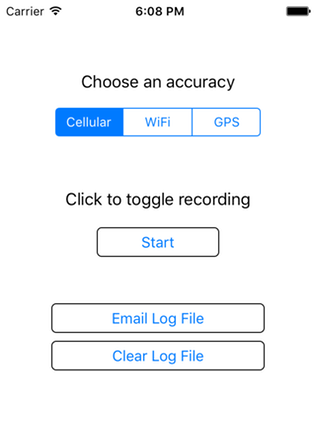
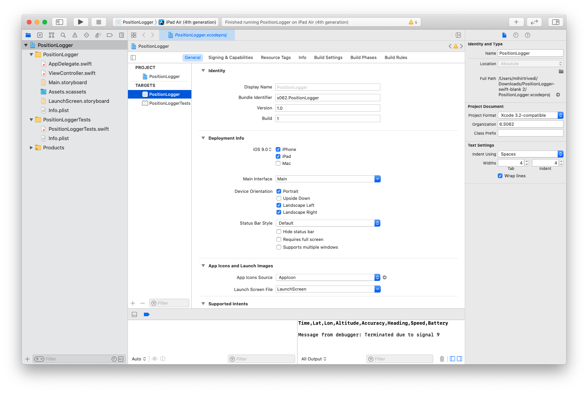
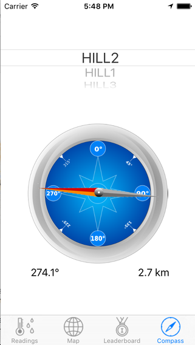
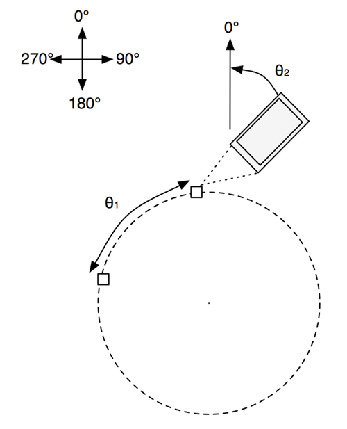

::: {#header_wrap .outer}
::: {#main_content .section .inner}
[6.1820](../index.html) {#project_title}
======================

Lab 1: Location {#project_tagline}
---------------

Assigned: 2025-02-11\
Due: 2025-02-20\
:::
:::

::: {#main_content_wrap .outer}
::: {#main_content .section .inner}

- [Location APIs and Exploring the Power Drain vs Accuracy
Tradeoff](#sec1)
    - [Getting Started](#s1_getting_started)
    - [iOS Location Primer](#ios_loc_primer)
    - [Task 1 - Capture Location Data](#task1)
        -  [1.1 Implement startRecordingLocationWithAccuracy](#sec1.1)
        -  [1.2 Implement stopRecordingLocationWithAccuracy](#sec1.2)
        -  [1.3 Implementing didUpdateLocations](#sec1.3)
        -  [1.4 Capture some data](#sec1.4)
    - [Task 2 -- Compare the Accuracy of the Location Methods](#task2)
    - [Task 3 -- Compare the Battery Drain of the Location Methods](#task3)
<!-- - [Section 2 -- Building the Anteater Compass](#sec2)
    - [Task 4 - Rotate the Compass Needle Image](#task4)
        - [4.1 Compute θ1](#sec4.1)
        - [4.2 Compute θ2](#sec4.2)
        - [4.3 Rotate the Needle by θ1 - θ2](#sec4.3) -->
- [Submission Instructions](#submission)

In this lab, you will start by developing a small standalone application
to measure location data, and then you will use it to collect real-world data.

Labs in 6.1820 consist of a number of tasks, each of which has one or
more deliverables. This lab has 3 tasks with varying number of deliverables.

Start working on the lab early. The lab requires you to collect data
by walking outdoor ([Task 2 -- Compare the Accuracy of the Location
Methods](#task2)) and leaving your phone without touching for 4 hours
twice. ([Task 3 -- Compare the Battery Drain of the Location
Methods](#task3)).

You may work on this lab in pairs.

Location APIs and Exploring the Power Drain vs Accuracy Tradeoff {#sec1}
----------------------------------------------------------------------------

You will use a standalone iOS app called PositionLogger

The PositionLogger app allows you to log position data at different
accuracies, using different positioning technologies, including WiFi,
Cellular, and GPS.

We\'ve provided most of the code for the PostitionLogger App, including
a simple UI for choosing a desired accuracy, as well as an interface to
email a log file of recorded positions out of the app. The main UI of
the PostionLogger is shown below:

Your job is to implement the calls to the iOS CoreLocation API to
request location updates at the desired accuracy, and then compare the
accuracy and power drain of the different approaches.

### Getting Started {#s1_getting_started}

1.  Download the [PositionLogger source
    code](codes/lab1/PositionLogger-swift-blank-4.2.zip).
2.  Unzip it. This will create a directory called
    \"PositionLogger-swift-blank\", containing an XCode project.
3.  Open PositionLogger.xcodeproj in XCode on a Mac.
4. **Important:** If you are testing on an iPad, go to PositionLogger > General > check iPad (under "Deployment Info")
5. Compile and run the app, either on your device or in the simulator
    (use the appropriate simulator.) It should show a screen like what
    you see above. Clicking on the Start button should cause it to enter a
    recording state, but it won\'t actually be writing location data
    until you add the code to record location. Note that you may have to
    update \"Team\" to your own account (General Tab -\> Signing in
    Xcode 10 or \"Signing and Capabilities\" Tab -\> Signing in Xcode
    11). Update the Bundle Identifier if needed.

Make sure "iPad" is checked if you are simulating and uploading to an iPad.

### iOS Location Primer {#ios_loc_primer}

The primary way that location is accessed on iOS use though the
[CoreLocation class
CLLocationManager](https://developer.apple.com/documentation/corelocation/cllocationmanager).
Using this class you can request location updates at a certain accuracy,
and also configure the accuracy with which data is created.

In the PositionLogger app, the main screen is an instance of a
ViewController object (as specified in ViewController.swift.) iOS
creates one instance of the ViewController class for us when the
application is initialized, because the Main.storyboard file, which we
chose as the main storyboard for the app in the Info.plist file,
specifies that the initial view for the app should be an instance of
ViewController.

In the viewDidLoad method of ViewController.swift, we\'ve already
created an instance of a CLLocationManager object for you to use and
initialized some of the relevant properties of it. These are the lines
at the beginning of the viewDidLoad method:

    1 self.locationManager = CLLocationManager()
    2 self.locationManager?.requestAlwaysAuthorization()
    3 self.locationManager?.allowsBackgroundLocationUpdates = true
    4 self.locationManager?.delegate = self
    5 self.locationManager?.distanceFilter = kCLDistanceFilterNone
    6 self.locationManager?.disallowDeferredLocationUpdates()

You can read about the details of the methods in the CLLocationManager
documentation, but the gist of this code is that we are requesting that:

Lines 2 & 3: Location updates be delivered all the time, even when the
app is in the background (we have also added an entry to the \"Required
Background Modes\" dictionary of the Info.plist file in the project to
allow this to work).

Line 4: The LocationManager will call methods indicating the arrival of
new data on our class (we are the \"delegate\" of the LocationManager).

Line 5: We want location updates whenever they are available (no matter
how little the phone has moved).

Line 6: We want iOS to deliver location updates to us immediately, not
batch them together.

Note that the settings in line 5 & 6 may have negative implications on
the battery life of the device, but they will allow us to get the
highest fidelity data for this lab.

### Task 1 -- Capture Location Data {#task1}

The goal of this first task is to log location data to a file and
perform some simple analysis of the data.

To acquire the log, you will need to modify the PositionLogger app to
start capturing location samples when the \"Start\" button is tapped.
Open the ViewController.swift file. We have implemented most of this
class for you \-- scroll down and find the hitRecordStopButton method:

    if(!self.isRecording) {
        self.accuracyControl.isEnabled = false
        sender.setTitle("Stop", for: UIControlState.normal)
        self.isRecording = true
        self.recordingIndicator.startAnimating()
        switch self.accuracyControl.selectedSegmentIndex {
        case 0:
            self.startRecordingLocationWithAccuracy(LocationAccuracy.Cellular)
        case 1:
            self.startRecordingLocationWithAccuracy(LocationAccuracy.WiFi)
        case 2:
            self.startRecordingLocationWithAccuracy(LocationAccuracy.GPS)
        default: ()
        }
    } else {
        self.accuracyControl.isEnabled = true
        sender.setTitle("Start", for: UIControlState.normal)
        self.isRecording = false
        self.recordingIndicator.stopAnimating()
        self.stopRecordingLocationWithAccuracy()
    }

This method calls startRecordingLocationWithAccuracy or
stopRecordingLocationWithAccuracy as appropriate. You need to implement
the body of these methods.

### 1.1 Implement startRecordingLocationWithAccuracy {#sec1.1}

startRecordingLocationWithAccuracy should set the desiredAccuracy
property of the CLLocationManager object to the appropriate accuracy
based on the supplied value of the acc argument. Note that iOS does not
explicitly allow an application to request GPS, WiFi, or Cellular
positioning \-- instead it provides the following constants to choose
from:

    extern const CLLocationAccuracy kCLLocationAccuracyBestForNavigation;
    extern const CLLocationAccuracy kCLLocationAccuracyBest;
    extern const CLLocationAccuracy kCLLocationAccuracyNearestTenMeters;
    extern const CLLocationAccuracy kCLLocationAccuracyHundredMeters;
    extern const CLLocationAccuracy kCLLocationAccuracyKilometer;
    extern const CLLocationAccuracy kCLLocationAccuracyThreeKilometers;

You also need to call startUpdatingLocation on the CLLocationManager.

### 1.2 Implement stopRecordingLocationWithAccuracy {#sec1.2}

stopRecordingLocationWithAccuracy just needs to call
stopUpdatingLocation on the CLLocationManager object. (It\'s OK to call
this function on the CLLocationManager even if it is already stopped.)

### 1.3 Implementing didUpdateLocations {#sec1.3}

The next step is to implement code to log position updates as they
arrive. We\'ve already set up the instance of ViewController.swift as
the delegate of the CLLocationManager object. This means that it will
call the didUpdateLocations method on ViewController.swift when a
location update is available. You need to implement this method. Its
signature is as follows:

    optional func locationManager(_ manager: CLLocationManager, didUpdateLocations locations: [CLLocation])

Your implementation of didUpdateLocations should iterate through the
locations and log them to the file. We\'ve provided a method
logLineToDataFile that logs a String to the log file (which you can then
email to yourself using the email button.)

In the later part of this lab, you\'re going to visualize and analyze
this data, so you\'ll need to at minimum log the reading\'s timestamp,
latitude, longitude, and horizontal accuracy, along with the battery
level of the device. To get the current battery level you can call:

    UIDevice.current.batteryLevel

We\'d also suggest logging the course (bearing) and speed attributes
from the supplied CLLocation objects. For time, we suggest just
converting the timestamp (NSDate) object in each CLLocation to a Unix
time stamp:

    location.timestamp.timeIntervalSince1970

Note that we currently write a header at the start of the log file in
the viewDidLoad method:

    self.logLineToDataFile("Time,Lat,Lon,Altitude,Accuracy,Heading,Speed,Battery\n")

You may want to modify this depending on what you choose to log.

### 1.4 Capturing some data {#sec1.4}

We\'ve implemented the rest of the application to allow you to capture
data from it and email data to yourself. Verify that it works by
attempting to log some data with GPS accuracy on your phone and email it
to yourself (note that location updates can be simulated in the
simulator, but that the simulator does not support the email interface
properly).

To make sure that the app always has access to location information
(especially in iOS 13), go to **Settings -\> Privacy -\> Location
Services -\> PositionLogger -\> select \"Always\"**.

In the rest of this part of the lab you\'ll collect some data outdoors
and compare the different location methods, looking at accuracy and
power of the different techniques.

There are no deliverables for this task.

### Task 2 -- Compare the Accuracy of the Location Methods {#task2}
<!-- #### STOP! Read the update for 2021:

- If you are in the Boston area, see below for a route that you could test along. If you aren't in the Boston area (or far from campus), pick any route that you can safely walk on outside (e.g. on a proper sidewalk, through a park, etc.) that is about the same distance ~0.3 mi. Please DO NOT attempt to walk on a road or an environment where you can't safely look at your iPad/iPhone while walking around. If you are not able to find an appropriate location to test this task, please email us! We will work together to figure out a solution. -->

In this exercise, you will walk from the corner of Vassar and Main to
the corner of Vassar and Mass Ave three times. For each walk, you\'ll
run the app at a different location accuracy, and compare the difference
in the overall estimated distance and plot the points on a map.

See this map for the route you will walk:
<https://www.google.com/maps/d/edit?mid=zcVI9zKum-vM.kVzhADJu9RDg&usp=sharing>

According to Google, the length of this route is .306 miles (492.5
meters).

Specifically, for each of the three accuracy settings:

1.  Start at one end of the route
2.  If you have other apps on the phone, we suggest disabling location
    services for any that are currently using location services, in
    Settings -\> Privacy. This is important because other apps using
    location services can cause your app to receive a finer granularity
    of location data that you requested.
3.  Open the app, set to the desired accuracy setting, and start
    recording
4.  Walk the route (you can close the app or leave it open)
5.  At the end of the route, stop recording, and email yourself the log
    file.
6.  Clear the log

Once you have the three log files, your task is to compute the \"connect
the dots\" distance for each path, and to plot each path on a map.

The \"connect the dots\" distance of a path is just the sum of the
distances between every consecutive point. Each point is a
latitude/longitude pair, which represents a point on the surface of the
earth. For points that are close together, Euclidian distance is a close
approximation of the actual distance, but for points that are far apart,
a straight line can be quite far from the true distance between these
points, which follows an arc on the surface of the Earth. The typical
way to estimate this distance is to assume the Earth is a sphere (it
isn\'t exactly spherical but pretty close), and to use the haversine
formula to compute the distance between the two
points:

$$
2r \arcsin\left(\sqrt{\sin^2\left(\frac{\text{lat}_2 - \text{lat}_1}{2}\right) + \cos(\text{lat}_1) \cos(\text{lat}_2)\sin^2\left(\frac{\text{lon}_2 - \text{lon}_1}{2}\right)}\right)
$$

where the two points are $(\text{lat}_1, \text{lon}_1)$ and $(\text{lat}_2,
\text{lon}_2)$ and $r$ is the Earth\'s radius (6371 km). Be sure to convert lat/lon
to radians (multiply by $\pi$ and divide by 180.0) before using built-in
trigonometric functions (see <https://en.wikipedia.org/wiki/Haversine_formula>).

For each of the three logs, compute the \"connect the dots\" distance
between all points in the trace using the haversine formula. How does it
compare to the measure .306 miles (492.5 meters)?

In addition, plot each of the three files on a map. We\'ve provided a
script, [csv2kml.py](codes/lab1/csv2kml.py), that will convert a csv
file with a header line that includes \"Lat\" and \"Lon\" fields into a
KML file that you can view on Google Earth or import into Google My Maps
(<https://mapsengine.google.com/map/>). If you\'d prefer, you may
visualize these files using some other method than Google Maps / Google
Earth.

The deliverables for this task are the connect-the-dots distance you
computed for the three different walks, as well as a plot of each of the
three walks you did on a map.

### Task 3 -- Compare the Battery Drain of the Location Methods {#task3}

For this task, you will compare the battery drain of the cellular and
GPS location accuracy settings. To do this, you\'ll need to start
logging and let the app run for several hours (4 hours should be long
enough), and then compare the battery level and the rate of drain while
the app runs.

For the cellular and GPS settings

1.  Fully charge the phone
2.  If you have other apps on the phone, we suggest disabling location
    services for any that are currently using location services, in
    Settings -\> Privacy. Also, enable Low Power Mode in Settings -\>
    Battery.
3.  Open the app, set to the desired accuracy setting, and start
    recording
4.  Turn off the screen and do not use the phone for 4 hours. The app
    will continue to record in the background.
5.  Stop recording and email yourself the file.
6.  Clear the log.

Once you have the two log files, make a plot of the battery level of
each over time, by using the time and battery level fields in the file.
You can make your plot which whichever tool you like: Google Charts,
Excel, pyplot, etc.

The deliverable for this task is the graph of the battery drain of the
two different location methods. Note that if you don\'t have cellular
service on the phone, running with cellular accuracy may produce results
different than you expect!

<!-- Section 2 -- Building the Anteater Compass {#sec2}
------------------------------------------

In this part of the lab, you\'ll work with the Anteater app and add
location-based features.

Recall that the Anteater App is a crowdsourced sensor data collection
app, where users earn points for collecting sensor data from nearby
sensors. In the Anteater app, mobile devices are the anteaters, and the
sensors are the anthills.

Start by downloading the [Anteater App Skeleton for Xcode 11/iOS
13](codes/lab1/anteater-swift-4.2-xcode11.zip). (For Xcode 10/iOS 12,
use [this app skeleton](codes/lab1/anteater-swift-4.2.zip) instead.)

Uncompress this file to create a directory called
\"anteater-swift-blank\". Open the anteater.xcodeproj file in this
directory in XCode. You should be able to build and run the project in
the simulator or your phone. This app is not able to connect to
Bluetooth-based Anthills (you\'ll do that in the next lab), and the
compass won\'t rotate (that\'s the goal of this lab).

Known issue for Xcode 11/iOS 13: when you build and run the app in your
iPhone for the first time and try to log in with any username, the app
may crash. Simply build and run again. The app should skip the log-in
screen without any error.

In later labs you\'ll work on the code to connect to the anthills, but
for the second part of this lab, your job is to implement the compass UI
in Anteater, as shown in the screenshot below.

In this interface, the orange arrow points the user what direction they
should turn/walk to move towards the selected Anthill.

To compute the direction this arrow should point, you need to measure
the angle between the user\'s current position (represented by a lat/lon
point), and the destination anthill. The conventional way to do this is
to model the earth as a sphere, and measure the angle of vector from the
origin to the destination along the shortest path (the \"great circle
path\"). The trigonometry to do this is fairly hairy, but thanks to the
Internet the formula is easy to look up. Here\'s the code to do this:

`atan2(sin(lon2-lon1)*cos(lat2), cos(lat1)*sin(lat2)-sin(lat1)*cos(lat2)*cos(lon2-lon1))`

Here (lat1, lon1) is the starting point, and (lat2, lon2) is the ending
point. In this formula, lat and lon need to be converted to radians, and
the result is in radians.

If you are curious about the derivation of this, there\'s a good
explanation half way down this post:
<http://mathforum.org/library/drmath/view/55417.html>

From the article: *\"Let\'s define three unit vectors, each in the
direction of the line from the center of the earth to a point on the
surface: N in the direction of the north pole, A in the direction of the
initial point, and B in the direction of the final point on the course.
Then the bearing we seek is the angle between the plane containing N and
A, and the plane containing A and B. Thus it equals the angle between
vectors perpendicular to these planes, namely, NxA and BxA.\"*

Computing this is straightforward trigonometry, although the explanation
for the use of the atan2 function is non-obvious.

Once you\'ve figured out the angle between the user\'s current location
and the destination anthill, you need to figure out the orientation of
the phone relative to North, and subtract that angle from the bearing to
the destination, as shown in this diagram:

Putting it all together, once you compute the two angles, subtract θ2
from θ1, and set the rotation of the compass graphic to that value. (To
see why we subtract θ2, imagine that the phone is already pointed in the
direction of the destination. In that case, θ1≈θ2.) The next task will
walk you through implementing the steps.

### Task 4 - Rotate the Compass Needle Image {#task4}

There are three subtasks: first, get the user\'s location and compute θ1
(based on the currently selected anthill); second, compute the
orientation of the phone and compute θ2; third, set the orientation of
the needle image.

We\'ve created CompassViewController.swift for you, but you will need to
write most of the code. We\'ve configured the UI to have a reference to
the needle image.

#### 4.1 Compute θ1 {#sec4.1}

You can compute θ1 using the above formula once you have both the
user\'s location and the location of a target anthill. In the code
we\'ve given you, there is an anthills array that is loaded when the
view appears. When the user changes the currently selected anthill, the
following method will be called:

    func pickerView(_ pickerView: UIPickerView, didSelectRow row: Int, inComponent component: Int) {

    }

You should fill in the body of this with code to recompute the angle to
the current anthill. You may want to define a helper function to do
this, because you will also want to recompute when the user\'s location
changes. (You won\'t be able to test this until you implement the
following paragraph.)

We\'ve also initialized a CLLocationManager object and request that it
start providing location updates to CompassViewController. You\'ll need
to fill in the body of the didUpdateLocations method to get the user\'s
current location, and update the current estimated angle to the selected
anthill (using the same function you defined when the anthill changed.)

Note: to extract the latitude and longitude of the anthill, use this:

    let anthill = self.anthills?[row] as! [String: Any]?
    let lat = anthill?["lat"] as? Double
    let lon = anthill?["lon"] as? Double

#### 4.2 Compute θ2 {#sec4.2}

Modern iPhones have a magnetometer that can measure the orientation of
the phone with respect to the Earth\'s magnetic field (its heading). An
app can be requested to be notified of the phone\'s heading as it
changes by calling the startUpdatingHeading method on the
CLLocationManager object. We have already done this for you in
CompassViewController.swift\'s viewDidLoad method. You should fill in
the body of the locationManager:didUpdateHeading method with code to
compute θ1 - θ2. You can access the current heading of the device (in
degrees) by accessing the trueHeading property of the provided
newHeading object.

#### 4.3 Rotate the Needle by θ1 - θ2 {#sec4.3}

Whenever you get an update to the device\'s location or orientation, or
a new anthill is selected, you should update the rotation of the needle.
The needle is a UIView that is available as a property of
CompassViewController. In iOS you can rotate (and scale/transform) any
view simply by setting the value of the `transform` field of the view.
This field is an instance of a CGAffineTransform struct. You can create
a transform that specifies a particular rotation by calling
[CGAffineTransform.init with
rotationAngle](https://developer.apple.com/documentation/coregraphics/cgaffinetransform/1455666-init)
in Swift. Create a transform and assign it to the needle property of
your CompassViewController. The UI will automatically rotate the view to
the correct orientation.

In addition, set the text of the distanceLabel label to the distance to
the current anthill and the text of the headingLabel label to θ1 - θ2.

The deliverable for this task is a working implementation of the
Anteater compass. -->

Submission Instructions {#submission}
-----------------------

Write up your answers to the following items in a single PDF file and
submit the PDF file on
GradeScope by **Feb 20, 11:59 PM**. If you work with a partner, you only need to submit once. You can get a checkoff during Office Hours within a week after the
submission deadline. You do not need to submit
your code, but we may ask to look at your code during the checkoff.

1.  Names and MIT emails (including your lab partner, if available)
2.  Accuracy levels for GPS, WiFi, and Cellular (e.g.
    `kCLLocationAccuracyBest`) (Three answers)
3.  Estimated distances in meters for the three methods from Task 2
    (Three answers)
4.  Maps of the points/trajectories for three methods (screenshot(s))
5.  Plots of the battery drain for Task 3 (cellular and GPS)
6.  Estimated number of hours you spent coding for the lab
7.  Estimated number of hours you spent collecting/analyzing data
<!-- 9.  Estimated number of hours you spent on Section 2 -->
8. Any comments/suggestions for the lab? Any questions you may have for
    the checkoff? (Optional)

During the checkoff, we may ask you to show a demonstration of an
Application, show the experiments\' results, or explain if and why the
results are as expected (or unexpected).
:::
:::
